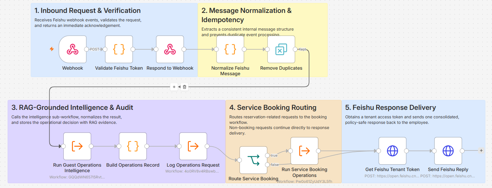
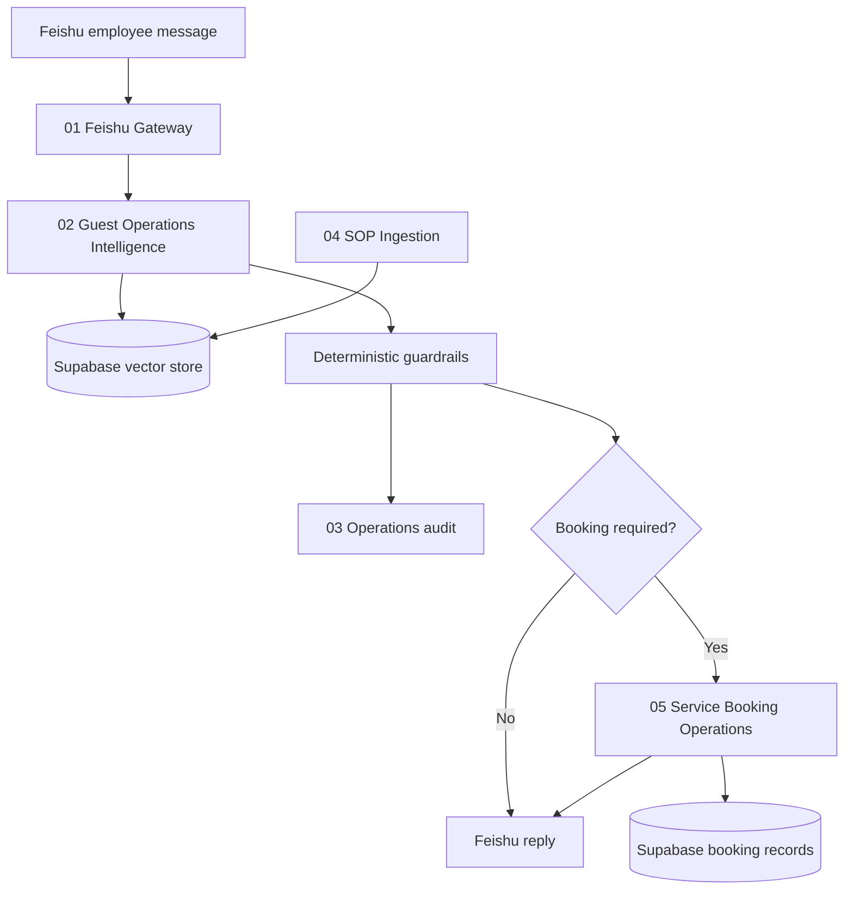
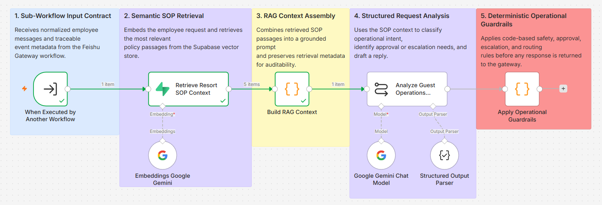
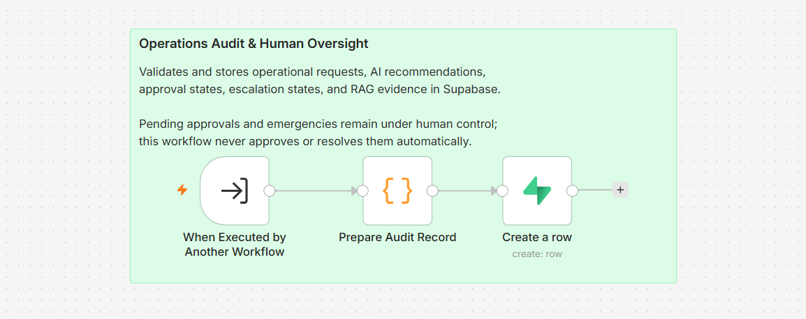
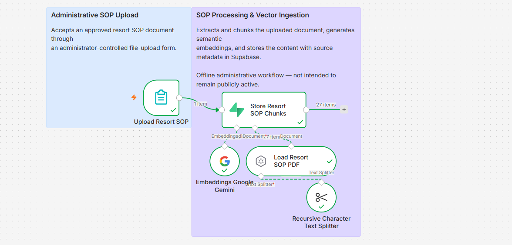
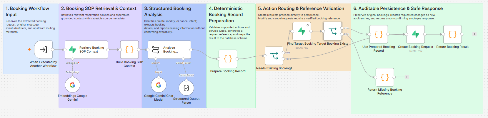

# Resort Guest Operations Copilot

An internal, RAG-grounded operations assistant for resort employees, built with n8n, Feishu, Supabase, pgvector, and Google Gemini.

The system receives an employee message in Feishu, retrieves relevant resort SOP passages, produces a structured operational recommendation, applies deterministic safety and approval guardrails, stores an audit record, routes reservation requests through a dedicated booking workflow, and returns a concise response to the employee.

> Portfolio demo: Harborlight Bay Resort and all policies, prices, guests, rooms, and booking references in this repository are fictional.



## Why this project

This project demonstrates more than a chatbot response. It combines:

- webhook validation and fast acknowledgement;
- message normalization and duplicate protection;
- semantic retrieval from a versioned SOP;
- structured LLM output instead of free-form routing;
- deterministic JavaScript guardrails after the model;
- explicit human approval and emergency escalation boundaries;
- auditable persistence of model decisions and RAG evidence;
- create, modify, and cancel booking-request lifecycles;
- negative-path handling for nonexistent booking references.

## Architecture



## Workflows

| Workflow | Responsibility |
| --- | --- |
| `01 - Feishu Gateway` | Receives and validates Feishu events, normalizes messages, prevents duplicate processing, orchestrates sub-workflows, and sends one consolidated reply. |
| `02 - Guest Operations Intelligence` | Retrieves SOP context, performs structured request analysis, and applies deterministic operational guardrails. |
| `03 - Operations Audit & Approval` | Validates and stores operational decisions, approval states, escalation states, and retrieval evidence. |
| `04 - Resort SOP Ingestion` | Administrative/offline ingestion of an approved SOP PDF into the Supabase vector store. |
| `05 - Service Booking Operations` | Handles create, modify, and cancel booking requests without falsely claiming availability or confirmation. |

Detailed workflow screenshots are available in [`docs/images`](docs/images).

<details>
<summary>Workflow 01 - Feishu Gateway</summary>


</details>

<details>
<summary>Workflow 02 - Guest Operations Intelligence</summary>



</details>

<details>
<summary>Workflow 03 - Operations Audit & Approval</summary>



</details>

<details>
<summary>Workflow 04 - Resort SOP Ingestion</summary>



</details>

<details>
<summary>Workflow 05 - Service Booking Operations</summary>



</details>

## Technology stack

- n8n Cloud
- Feishu Open Platform
- Supabase PostgreSQL + pgvector
- Google Gemini `gemini-3.5-flash-lite`
- Google Gemini embeddings (`gemini-embedding-001`, 3072 dimensions in this demo)
- JavaScript Code nodes
- SQL RPC similarity search

## Key design decisions

### RAG is evidence, not authority

The model receives retrieved SOP passages, but its output is not executed directly. Code nodes normalize fields and enforce approval, escalation, booking, and response rules.

### Human-in-the-loop boundaries

- Immediate safety, medical, security, fire, violence, missing-person, or serious facility hazards are escalated.
- Refunds, compensation, room moves, and policy exceptions require human approval.
- The assistant never grants approval itself.
- Booking requests remain pending until an external employee or provider verifies availability.

### Append-only booking requests

Modification and cancellation requests do not overwrite the original booking record. They create new, traceable request rows linked through `target_booking_reference`.

### Auditable RAG metadata

Audit rows retain whether grounding was available, the SOP source and version, retrieval count, and top similarity score.

## Repository structure

```text
.
├── README.md
├── database/
│   └── schema.sql
├── docs/
│   ├── test-report.md
│   └── images/
├── knowledge-base/
│   └── Harborlight_Bay_Resort_Operations_SOP.pdf
├── tests/
│   └── scenarios.json
└── workflows/
    ├── 01-feishu-gateway.json
    ├── 02-guest-operations-intelligence.json
    ├── 03-operations-audit-and-approval.json
    ├── 04-resort-sop-ingestion.json
    └── 05-service-booking-operations.json
```

## Setup

### 1. Create the database

Create a Supabase project and run [`database/schema.sql`](database/schema.sql) in the SQL editor.

This demo uses `vector(3072)`. Standard pgvector HNSW indexing does not support this dimensionality, so the included search function uses an exact scan suitable for a small portfolio dataset. A production deployment should select an embedding/index strategy appropriate for its data volume and latency requirements.

### 2. Import the workflows

Import the JSON files in this order:

1. `04-resort-sop-ingestion.json`
2. `02-guest-operations-intelligence.json`
3. `03-operations-audit-and-approval.json`
4. `05-service-booking-operations.json`
5. `01-feishu-gateway.json`

All exported workflows are inactive and contain no credential IDs, instance IDs, webhook IDs, or pinned execution data.

### 3. Configure credentials

Create and select your own credentials in n8n:

- Google Gemini API credential in workflows 02, 04, and 05;
- Supabase credential using a server-side service-role key in workflows 02, 03, 04, and 05;
- Feishu custom-auth credential for the tenant-token request in workflow 01.

Never expose a Supabase service-role key, Feishu App Secret, or Gemini API key in a public workflow or repository.

### 4. Reconnect the sub-workflows

Credential and internal workflow IDs were intentionally removed. In workflow 01, reselect:

| Execute Workflow node | Select after import |
| --- | --- |
| `Run Guest Operations Intelligence` | `02 - Guest Operations Intelligence` |
| `Log Operations Request` | `03 - Operations Audit & Approval` |
| `Run Service Booking Operations` | `05 - Service Booking Operations` |

Publish the child workflows before refreshing their input schemas in workflow 01.

### 5. Ingest the sample SOP

Open workflow 04, launch its upload form, and upload the fictional PDF from [`knowledge-base`](knowledge-base). Confirm that chunks are created in `resort_documents`.

### 6. Configure Feishu

Create a Feishu custom app with a bot, grant the required message receive/send permissions, configure the workflow 01 production webhook as the event callback, subscribe to message events, and publish the app according to your tenant's approval process.

### 7. Publish runtime workflows

Publish in dependency order:

1. Workflow 05
2. Workflow 03
3. Workflow 02
4. Workflow 01

Workflow 04 is an administrative ingestion flow and can remain inactive when it is not being used.

## Test summary

The project was manually integration-tested through Feishu and Supabase on 2026-09-17.

| Scenario | Expected behavior | Result |
| --- | --- | --- |
| Routine amenity request | Routine response and acknowledged audit row | Pass |
| Free late checkout | Manager approval route; no unauthorized promise | Pass |
| Gas smell in kitchen | Critical human escalation and evacuation guidance | Pass |
| Crib request | Inventory and staff-installation checks from SOP | Pass |
| Complete spa request | Pending availability; booking request inserted | Pass |
| Operational + breakfast request | Separate operational and booking handling | Pass |
| Modify existing booking | Original preserved; modification request appended | Pass |
| Cancel existing booking | Original preserved; cancellation request appended | Pass |
| Unknown booking reference | Safe rejection; no booking row inserted | Pass |

See [`docs/test-report.md`](docs/test-report.md) and [`tests/scenarios.json`](tests/scenarios.json) for reproducible inputs and assertions.

## Known limitations

- No live PMS, spa, restaurant, transport, or inventory provider is connected.
- Booking requests are recorded but never represented as confirmed.
- Human approval state is logged; this demo does not provide a manager approval UI.
- The 3072-dimensional demo vector store uses exact similarity search rather than an ANN index.
- Production deployment would require monitoring, retries, secret management, retention rules, and organization-specific security review.

## Security and privacy

- Public workflow exports contain no credentials or environment-specific workflow IDs.
- The sample SOP and all test messages are synthetic.
- The workflow avoids requesting unnecessary sensitive guest information.
- Production execution logs should follow the organization's access and retention policies.
